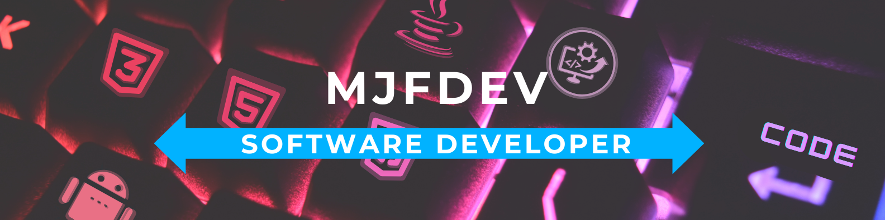

  <h1>Hi human, I am Manu 🖖</h1>
  
   
  

---

## 🤖 About Me
- 🙍‍♂️ I am a multiplatform application developer passionate about technology and constantly learning to improve.
- 🤝 I enjoy collaborating with other developers to learn and grow together.
- 🧑‍💻 Eager to contribute to open-source projects to enhance skills and knowledge.

---

## 💻 Technologies

### Programming Languages
#### Frontend & Web

  
  
  

#### Backend

  
  
  

#### Mobile

  
  

### Tools & Frameworks
#### Web Development

  

#### Database Management

  
  

### Development Tools

  
  
  
  

### Cloud & Deployment

  
  

### Others

  
  
  

