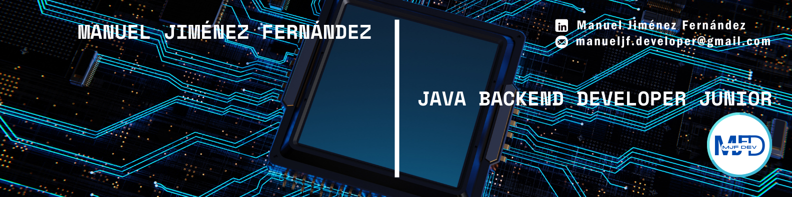

  

<h3 align="center">
Software Developer • Web Development • Automation • AI & Prompt Engineering
</h3>

---

# 👨‍💻 Sobre mí

💻 **Java Backend Developer Junior** con formación en **Desarrollo de Aplicaciones Multiplataforma (DAM)** y experiencia en desarrollo web, aplicaciones Android y automatización de procesos.

Me especializo en la construcción de **APIs, sistemas backend y soluciones escalables**, participando en proyectos reales como plataformas de **digitalización documental** y desarrollo de aplicaciones completas.

🚀 Interesado en seguir creciendo como **Backend Developer en Java**, aplicando buenas prácticas, testing y arquitectura de software.

---

# 🧠 Tech Stack

## Lenguajes

Java • Kotlin • JavaScript • Python • PHP • HTML5 • CSS3 • SQL • XML • PowerShell

---

## Frameworks y Librerías

React.js • Vue.js • Angular • Bootstrap • jQuery • Materialize • SweetAlert2 • DataTables

---

## Bases de Datos

MySQL • SQL • Firebase • REST APIs • Google Apps Script

---

## Herramientas

Git • GitHub • VS Code • IntelliJ IDEA • Eclipse • Android Studio • Postman • VirtualBox

---

# ⚙️ Tecnologías y conocimientos

- REST APIs  
- AJAX  
- JSON  
- Responsive Design  
- Single Page Applications (SPA)  
- UI / UX  
- SEO técnico  
- Automatización de procesos  
- Google Apps Script  

---

# 🧩 CMS y plataformas

- WordPress  
- Joomla  
- Magnolia CMS  
- SharePoint  

---

# 📚 Certificaciones

- Python Essentials 1 & 2  
- JavaScript Essentials  
- Java y Programación Orientada a Objetos  
- Prompt Engineering  
- IA Responsable & Prompt Engineering  
- Excel Intermedio & Avanzado  
- Introducción al Desarrollo Web  
- Introducción a Apps Móviles  
- Ciberseguridad en Teletrabajo  

---

# ⚙️ Metodologías

- Scrum  
- MVC  
- Testing  
- Debugging  
- Documentación técnica  
- Trabajo en equipo  

---

# 💡 Filosofía

Clean Code  
Aprendizaje continuo  
Automatización inteligente  
Tecnología para resolver problemas reales  

---

⭐ Gracias por visitar mi perfil

